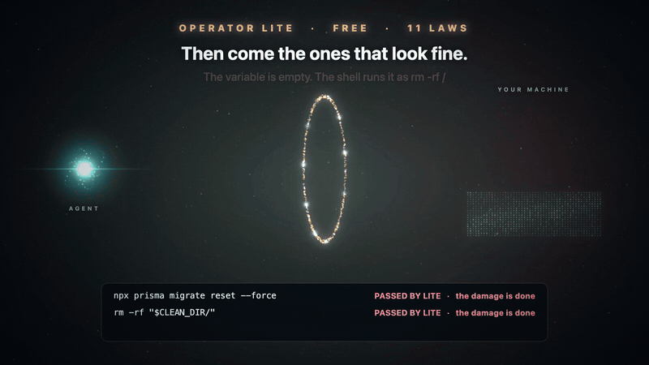

<p align="center">
  
</p>

# Vestige

Vestige is a fail-closed runtime firewall for AI agents. The model proposes, a deterministic gate decides, and every action leaves a receipt. When something breaks, `causal_walk` finds the real cause.

[](https://github.com/samvallad33/vestige/releases/latest)
[](https://github.com/samvallad33/vestige/actions)
[](https://github.com/samvallad33/vestige/releases/latest)
[](LICENSE)

## The problem

Agents run `rm -rf`, force-push, drop tables, and overwrite `.env` on their own, and nothing stops them. When something breaks, similarity search finds lookalikes, not causes.

## Vestige Operator

[](operator-lite/media/from-lite-to-operator.mp4)

Click the picture to watch the full film.

Operator Lite is free and stays free. Vestige Operator is the owner's version of the same gate: $149 once, and every later version is yours at no charge, with laws you write, a Board of today's stops, and a weekly Letter of what your agents tried and what stopped them. You download a small archive the moment you pay; from an installed Operator Lite, `upgrade --install <the archive you downloaded>` unpacks it and starts the wizard.

[Buy Vestige Operator](https://payhip.com/b/d4xvu)

## Quick start

Operator Lite is the free gate in [`operator-lite/`](operator-lite/). It is one file, stdlib only, and it sits on a PreToolUse hook (Claude Code, Codex, OpenClaw, or any host with command hooks).

macOS and Linux:

```bash
curl -fsSL https://raw.githubusercontent.com/samvallad33/vestige/main/operator-lite/operator-gate.py -o /tmp/operator-gate.py && python3 /tmp/operator-gate.py install
```

Windows, in PowerShell, with Python 3.9 or newer:

```powershell
curl.exe -fsSL https://raw.githubusercontent.com/samvallad33/vestige/main/operator-lite/operator-gate.py -o "$env:TEMP\operator-gate.py"; python "$env:TEMP\operator-gate.py" install
```

OpenClaw:

```bash
clawhub install vestige-operator-lite
```

Install copies the gate to `~/.operator/gate`, registers the Claude Code hook, and starts in shadow mode, which records every verdict and blocks nothing. It then replays your last 30 days of Claude Code history through the same rules. Nothing in that history is executed. When that looks right, switch it on with `mode enforce`.

## Proof

`replay` prints a scoreboard. From a made-up history:

```
operator-gate replay: the last 30 days on this machine. Nothing was executed.

       23  tool calls your agents made (2 Claude Code sessions, 2 projects)
        3  a built-in rule would have stopped
        1  flagged in shadow: recorded, not stopped
       14  no built-in rule decides: only you can

Would have been stopped (all of them):
  Mar 21  shop-api           OP-004 force push to a shared branch
                             git push --force origin main
  Mar 19  shop-api           OP-007 destructive SQL
                             psql $DATABASE_URL -c 'DROP TABLE sessions'
  Mar 14  infra              OP-003 recursive delete of ~/Documents/old-terraform-state
                             rm -rf ~/Documents/old-terraform-state

Flagged in shadow, recorded and not stopped:
      1  OP-S01 work-loss                   git reset --hard HEAD~1
```

- 27 deterministic rules: workspace armor, memory-store protection, destructive SQL, force-push, unreviewed publishes, paid deploys, reverse shells, cloud-metadata endpoints, shell-init poisoning, and MCP argument exfil.
- Shell obfuscation: quote reassembly (`r''m`), `$IFS`, `$(echo rm)` as the program, ANSI-C `$'\x72m'`, base64-decoded pipelines, brace and glob expansion against the live filesystem, subshell time-bombs, session variables, `cd` tracking, heredocs, and fork bombs.

Operator Lite receipts are hash-chained digests, not signatures. It only blocks what is routed through hooked tools.

## Causal root cause

`causal_walk` walks backward only over recorded edges: commits, tool calls, and memory writes. It does not use embeddings or keyword matching. With no start point it returns `needs_report` and names what is missing; a walk that finds no cause says why in `emptyBecause`, from the edges the log holds.

<a id="install"></a>
## Memory server

The memory server is a Strata signed append-only log. Every write is gated and returns a receipt. Install from a [release archive](https://github.com/samvallad33/vestige/releases/latest) or `brew install samvallad33/tap/vestige`. Archive names, PATH, flags, and `vestige.toml` are in the [reference](docs/REFERENCE.md#install).

```bash
claude mcp add vestige vestige-mcp -s user
codex mcp add vestige -- vestige-mcp
```

## Docs

[Getting Started](docs/GETTING-STARTED.md) · [Tool contracts](docs/TOOL-CONTRACTS.md) · [Configuration](docs/CONFIGURATION.md) · [Storage](docs/STORAGE.md) · [Upgrading from v3](docs/REFERENCE.md#upgrading-from-v3) · [Changelog](CHANGELOG.md) · [operator-lite/README.md](operator-lite/README.md) · [Reference](docs/REFERENCE.md)

<a id="vestige-pro"></a>
## License

AGPL-3.0-only.
