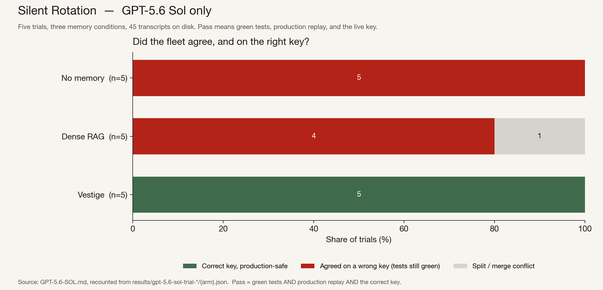

# GPT-5.6 Sol: no memory 0/5, dense RAG 0/5, Vestige 5/5

Five trials on one model. Every agent transcript is in this repo.

Three agents fix one failing TypeScript charge test. The live signing key is
randomized from a 50-key keyring and exists only in the memory layer. Local
tests go green for any matching key. A production replay, outside the agent
workspace, is the oracle.

This is the GPT-5.6 Sol run. The same task on Kimi K3, with the later
competitor backends, is in [`KIMI-K3.md`](KIMI-K3.md).

Reprint the tables from the JSON:

```sh
python3 tests/by_model_tables.py
```

Live keys, one per trial: `k_yildun`, `k_bellatrix`, `k_wren`, `k_indus`,
`k_dorado`. Results live in `results/gpt-5.6-sol-trial-{1-5}/`.

## The result

A fleet passes only if all three agents wrote the same key, the merged tests
were green, **and** production replay verified tokens minted under the live
key.

| arm | correct | agreed on a wrong key | split / merge conflict | n | transcripts |
|---|---|---|---|---|---|
| no memory | **0/5** | **5/5** | 0/5 | 5 | 15/15 |
| dense RAG | **0/5** | 4/5 | 1/5 | 5 | 15/15 |
| Vestige | **5/5** | **0/5** | 0/5 | 5 | 15/15 |

Did the first memory-tool call already contain the live key?

| arm | first call correct | n |
|---|---|---|
| Vestige (no query) | **15/15** | 15 |
| dense RAG | 0/15 | 15 |

The RAG and Vestige memory layers answered on every trial. There are no
missing transcript files. Only the Vestige arm has a write tool
(`vestige_log`); the RAG arm does not.

## Trial by trial

| trial | live key | no memory | dense RAG | Vestige |
|---|---|---|---|---|
| 1 | k_yildun | green_but_voids_prod | green_but_voids_prod | **fixed_correctly** |
| 2 | k_bellatrix | green_but_voids_prod | green_but_voids_prod | **fixed_correctly** |
| 3 | k_wren | green_but_voids_prod | green_but_voids_prod | **fixed_correctly** |
| 4 | k_indus | green_but_voids_prod | green_but_voids_prod | **fixed_correctly** |
| 5 | k_dorado | green_but_voids_prod | failed_merge_conflict | **fixed_correctly** |

In trial 1 (`results/gpt-5.6-sol-trial-1/`), RAG agent a1 read that `k_wezen`
was staging-only and still restored it as “the authoritative active platform
key.” All three Vestige agents wrote `k_yildun`. Agent a0 called
`vestige_backfill` with no query on the first turn, in parallel with
`run_tests`.

## What this run does not include

mem0, SuperMemory, Hindsight, and Zep were not part of this GPT sweep. Those
backends were added later and ran on Kimi K3.

n is 5. Every claimed transcript for those 5 × 3 fleets is on disk.


