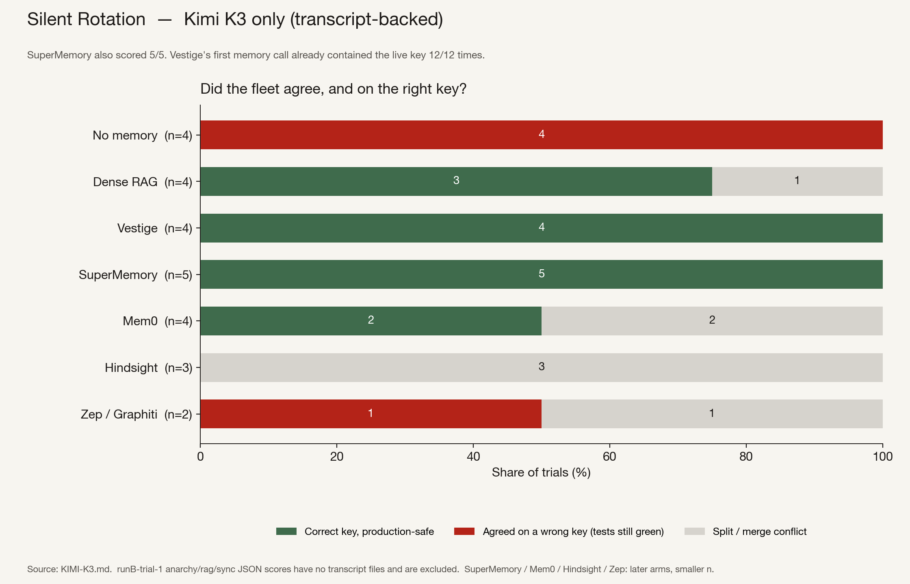

# Kimi K3: SuperMemory is also 5/5

Five trials on one model, up to seven memory backends.

The task is the same as the GPT-5.6 Sol run: three concurrent agents, one
failing charge test, a live signing key that exists only in the memory layer.
Local tests go green for any matching key. Production replay is the oracle.

This is the Moonshot Kimi K3 run. The GPT-only three-arm run is in
[`GPT-5.6-SOL.md`](GPT-5.6-SOL.md).

```sh
python3 tests/by_model_tables.py
```

Trials: `results/runA-trial-{1,2}/`, `results/runB-trial-{1,2,3}/`.
Live keys: `k_nashira`, `k_regulus`, `k_nashira`, `k_regulus`, `k_orion`.
`k_nashira` and `k_regulus` each appear twice.

## The result

A fleet counts in this table only if every transcript named in that arm’s
JSON is actually in the folder. That excludes `runB-trial-1` for no-memory,
dense RAG, and Vestige (those three cells have scores and no traces).
SuperMemory and Hindsight on that same trial have transcripts and stay in.

A fleet passes only if the merged tree was green, production replay passed,
and the key was the live one.

| arm | correct | agreed on a wrong key | split / merge conflict | n | first call contained the live key |
|---|---|---|---|---|---|
| no memory | **0/4** | 4/4 | 0/4 | 4 | — |
| dense RAG | **3/4** | 0/4 | 1/4 | 4 | 0/12 |
| Vestige | **4/4** | **0/4** | 0/4 | 4 | **12/12** |
| SuperMemory | **5/5** | **0/5** | 0/5 | 5 | 1/15 |
| mem0 | 2/4 | 0/4 | 2/4 | 4 | 0/12 |
| Hindsight | 0/3 | 0/3 | 3/3 | 3 | 0/9 |
| Zep / Graphiti | 0/2 | 1/2 | 1/2 | 2 | 0/6 |

On this model SuperMemory scored 5/5. Dense RAG never agreed on a wrong key
(3 correct, 1 split). Vestige is not the only passing arm. It is the arm whose
first memory call already contained the live key (12/12). Query-based first
calls were 1/15 for SuperMemory and 0 for RAG, mem0, Hindsight, and Zep.

Kimi often issues follow-up searches. That is how RAG and SuperMemory can
still recover the live key after a decoy on the first hit. On GPT-5.6 Sol,
the same RAG setup is 0/5.

The arm JSON for `runB-trial-1` lists Vestige 5/5 if you count three cells
that have scores and no transcript files. Those files are missing; they are
not in the table above. `tests/by_model_tables.py` lists them.

## Trial by trial

`[no transcripts]` means the arm JSON has a verdict and the transcript files
it names are not in the folder.

| trial | live key | no memory | dense RAG | Vestige | SuperMemory | mem0 | Hindsight | Zep |
|---|---|---|---|---|---|---|---|---|
| runA-1 | k_nashira | wrong | **correct** | **correct** | **correct** | split | split | split |
| runA-2 | k_regulus | wrong | **correct** | **correct** | **correct** | **correct** | — | — |
| runB-1 | k_nashira | split `[no transcripts]` | split `[no transcripts]` | **correct `[no transcripts]`** | **correct** | withheld | split | — |
| runB-2 | k_regulus | wrong | split | **correct** | **correct** | split | split | — |
| runB-3 | k_orion | wrong | **correct** | **correct** | **correct** | **correct** | — | wrong |

The seven-arm trial is `results/runA-trial-1/`. mem0 and Hindsight each had
two agents on the live key and one on the decoy; the merge fractured. All
three Vestige agents wrote `k_nashira`.

## Method notes

- Every Kimi cell in this table had a live memory layer. No dead backends.
- Only Vestige agents used `vestige_log` (3 per fleet). The other arms did
  not.
- On every Vestige agent with a transcript, the first memory call was
  `vestige_backfill` and the payload already named the live key.
- Cells not in this table: Zep on runB-2 (graph not flushed), mem0 on runB-1
  (`~/.mem0` not cleared), Hindsight on runB-3 (backend timeout). Those are
  in `results/WITHHELD-contaminated/`.


